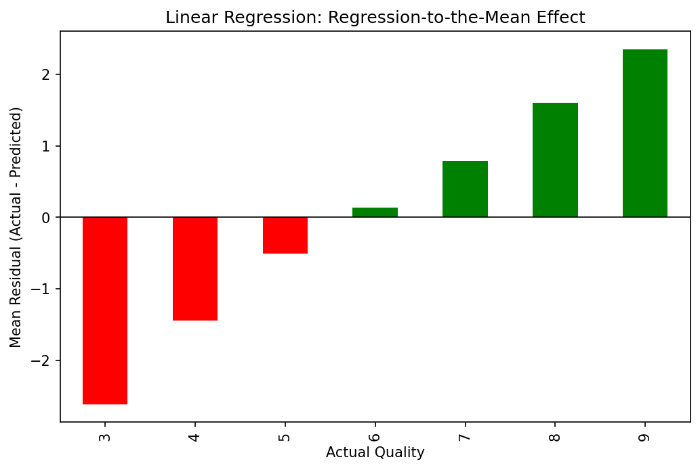
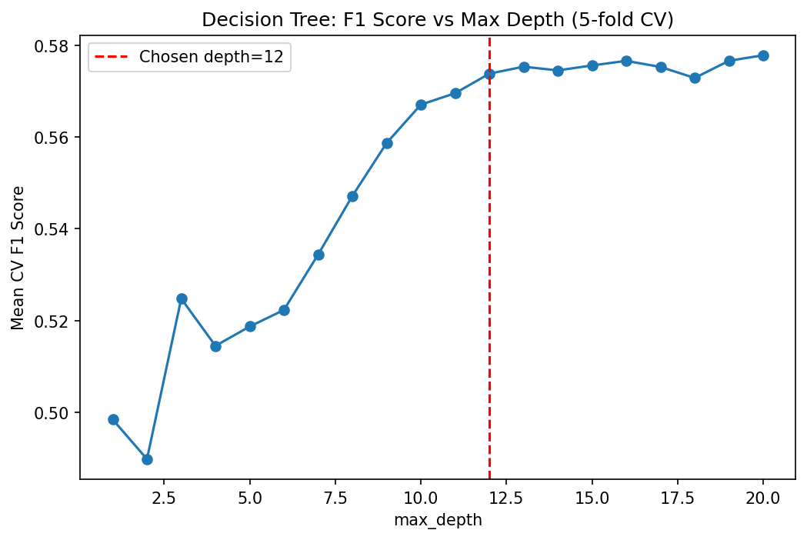
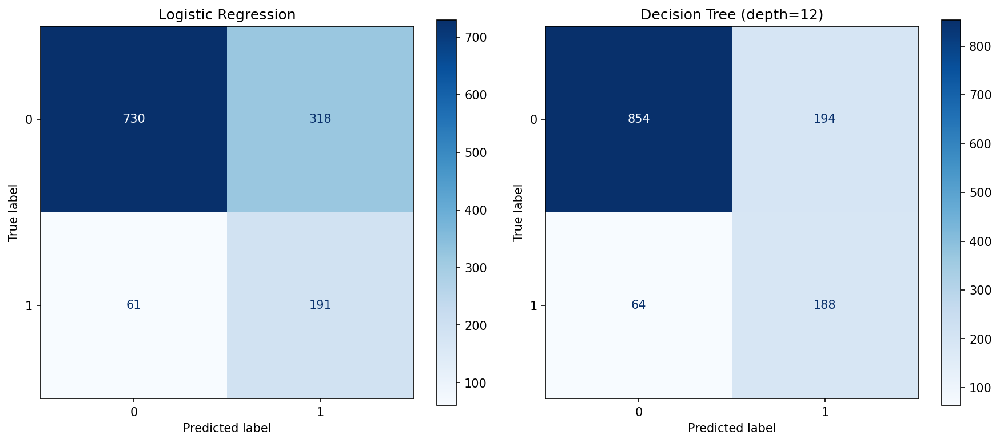
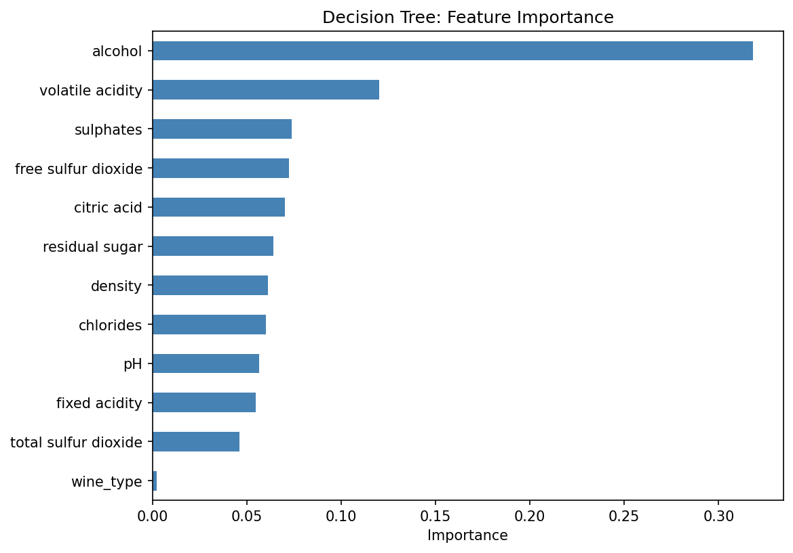

# Wine Quality Prediction: A Comparative Study of Classical Machine Learning Models

## Objective
This project investigates how three fundamental machine learning algorithms behave on the same real-world dataset rather than simply comparing accuracy scores.

Algorithms studied:
- Linear Regression
- Logistic Regression
- Decision Tree

The goal was to understand the strengths, weaknesses, assumptions, and failure modes of each model through systematic experimentation.

---

## Interactive Notebook

The complete analysis, visualizations, and model comparisons are available on Kaggle:

**Kaggle Notebook:** https://www.kaggle.com/code/jatinxvats/comparing-classical-ml-algorithms-on-the-same-data

---

## Research Question
> How do Linear Regression, Logistic Regression, and Decision Trees differ when solving the same prediction problem?

Instead of treating machine learning as a black box, this project focuses on interpreting model behavior, understanding trade-offs, and developing intuition from first principles.

---

## Dataset
**UCI Wine Quality Dataset**

The dataset contains physicochemical measurements of Portuguese red and white wines, including features such as:
- Alcohol
- pH
- Density
- Sulphates
- Citric Acid
- Residual Sugar
- Chlorides
- Volatile Acidity

The target variable is **wine quality**, assigned as the median score from at least three human experts through blind sensory tasting — not a direct chemical measurement. This means the target carries inherent subjective noise, which shapes how each model's performance should be interpreted.

---

## Workflow
1. Exploratory Data Analysis
2. Data Preprocessing & Verification
3. Linear Regression
4. Logistic Regression
5. Decision Tree
6. Cross Validation
7. Model Comparison
8. Business Recommendation

---

## Results

### Regression — Linear Regression

| Model | MAE | MSE | R² | Notes |
|---|---|---|---|---|
| Baseline (predict mean) | 0.669 | — | 0.000 | Naive reference point |
| Linear Regression | 0.564 | 0.541 | 0.267 | 15.7% MAE improvement over baseline; regression-to-mean on extremes |

- Successfully modeled the overall trend
- Exhibited a strong regression-to-the-mean effect
- Underestimated high-quality wines
- Overestimated poor-quality wines

---

### Classification — Logistic Regression & Decision Tree

| Model | Train F1 | Test F1 | Precision | Recall | ROC-AUC | Notes |
|---|---|---|---|---|---|---|
| Logistic Regression | — | 0.502 | 0.375 | 0.758 | 0.812 | `class_weight='balanced'`; high recall, low precision |
| Decision Tree (unlimited) | 1.000 | 0.640 | 0.638 | 0.643 | 0.778 | Severely overfit — perfect train score, large train/test gap |
| Decision Tree (depth=12, tuned) | 0.788 | 0.593 | 0.492 | 0.746 | 0.797 | More reliable despite slightly lower test F1 — smaller overfitting gap |

**Logistic Regression**
- Converted quality into a binary classification problem
- Used balanced class weights to address dataset imbalance
- Demonstrated the precision-recall trade-off

**Decision Tree**
- Deliberately allowed to overfit to study variance
- Tuned using 5-fold Cross Validation
- Final model selected using optimal tree depth
- The unconstrained tree scored marginally higher on this particular test set (Test F1 = 0.640), but the tuned depth=12 tree was chosen instead: its much smaller train/test gap (0.788 → 0.593 vs. 1.000 → 0.640) indicates lower variance and more reliable generalization to new, unseen wines.

---

## Key Insights
- Wine quality is inherently noisy because labels are assigned by human experts.
- Alcohol consistently emerged as the most informative feature.
- Linear models struggle to capture nonlinear decision boundaries.
- Decision Trees require pruning to generalize well.
- Cross-validation provides a more reliable estimate of model performance than a single train-test split.
- Model selection depends on the business objective, not only on raw accuracy.

---

## Recommendation
The tuned Decision Tree (depth=12) is the recommended model — not because it scored highest on any single metric, but because it offers the most reliable balance of precision, recall, and generalization. With a precision of 0.49, roughly half of its "good wine" predictions would be false alarms, so it is best deployed as a **first-pass screening tool** — narrowing a large batch of wines down to a shortlist for human tasters — rather than as a fully automated labeling system. Its recall of 0.75 means it would still surface the majority of genuinely good wines for review, making it a practical filter rather than a final decision-maker.

---

## Visualizations

### Regression-to-the-Mean


---

### Cross Validation for Decision Tree Depth


---

### Confusion Matrix Comparison


---

### Decision Tree Feature Importance


---

## Repository Structure
```text
01_wine_quality_comparison/
│
├── notebook.ipynb
├── report.md
├── requirements.txt
├── README.md
└── images/
```

---

## Future Work
- Random Forests
- Gradient Boosting
- Support Vector Machines
- Hyperparameter Optimization
- Model Explainability (SHAP)

---

## Key Takeaway
This project was completed as part of my **ML First Principles** learning journey.

Rather than optimizing solely for predictive performance, the objective was to understand *why* different machine learning algorithms behave differently on the same dataset and to build intuition through experimentation.
